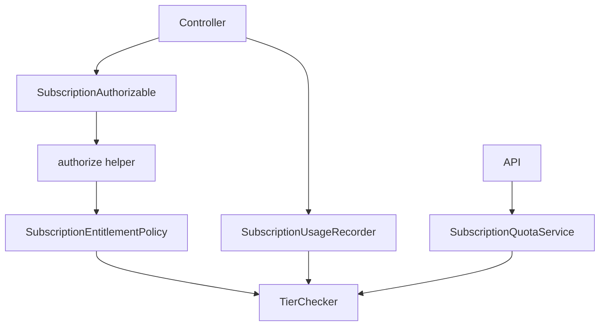

# Pundit Subscription Limit Enforcement — Implementation Plan

Companion to [subscription-tiers-features.md](./subscription-tiers-features.md).

CanCanCan stays for RBAC. Pundit handles subscription limits only.

---

## Design



| Layer | Responsibility |
|-------|----------------|
| **CanCanCan** | RBAC — unchanged |
| **`authorize`** | Pundit entry point in controllers |
| **`SubscriptionEntitlementPolicy`** | `access?` → delegates to `TierChecker` |
| **`TierChecker`** | Quota math — single source of truth |
| **`SubscriptionUsageRecorder`** | Increment counters after successful action |
| **`SubscriptionQuotaService`** | API check + consume |

Authorization and usage metering are **separate**. Pundit does not record usage.

---

## File structure

```
app/
  value_objects/
    subscription_context.rb
  policies/
    application_policy.rb              # generated — do not edit
    subscription_entitlement_policy.rb
  services/
    subscription_usage_recorder.rb
    subscription_quota_service.rb
    tier_checker.rb                    # cleanup only
  controllers/
    concerns/
      subscription_authorizable.rb
lib/
  subscription_features.rb
```

**6 new files.** No ActiveRecord changes.

---

## Step 1 — Gemfile & install

```ruby
gem "pundit", "~> 2.3"
```

```bash
bundle install
rails g pundit:install
```

---

## Step 2 — Feature constants

**`lib/subscription_features.rb`**

```ruby
module SubscriptionFeatures
  MAX_CBAIS         = "max_cbais"
  MAX_CONVERSATIONS = "max_conversations"
  MAX_DOCUMENTS     = "max_documents"
  ANALYTICS         = "analytics_enabled"
  PRIORITY_SUPPORT  = "priority_support"
end
```

Already autoloaded via `config.autoload_lib` in `config/application.rb`.

---

## Step 3 — Value object (Pundit record)

**`app/value_objects/subscription_context.rb`**

```ruby
class SubscriptionContext
  attr_reader :cbai, :feature_key

  def initialize(feature_key:, cbai: nil)
    @feature_key = feature_key.to_s
    @cbai = cbai
  end

  # Pundit resolves policy from record — no policy_class: needed at call site
  def self.policy_class
    SubscriptionEntitlementPolicy
  end
end
```

`user` comes from Pundit's `pundit_user` (i.e. `current_user`) — not stored on the context.

---

## Step 4 — Policies

### `app/policies/application_policy.rb`

Standard Pundit base — deny by default:

```ruby
class ApplicationPolicy
  attr_reader :user, :record

  def initialize(user, record)
    @user = user
    @record = record
  end

  def index?   = false
  def show?    = false
  def create?  = false
  def update?  = false
  def destroy? = false

  class Scope
    attr_reader :user, :scope

    def initialize(user, scope)
      @user  = user
      @scope = scope
    end

    def resolve = scope.all
  end
end
```

### `app/policies/subscription_entitlement_policy.rb`

One policy, one query method:

```ruby
class SubscriptionEntitlementPolicy < ApplicationPolicy
  def access?
    return false if user.blank?
    return false unless record.is_a?(SubscriptionContext)

    tier_checker.can_use?(record.feature_key)
  end

  private

  def tier_checker
    @tier_checker ||= TierChecker.new(user, record.cbai)
  end
end
```

- No limit math here — only delegation.
- `access?` is the single entitlement query.

---

## Step 5 — Controller concern

**`app/controllers/concerns/subscription_authorizable.rb`**

```ruby
module SubscriptionAuthorizable
  extend ActiveSupport::Concern

  class_methods do
    # Declares a Pundit check as a before_action.
    #   requires_subscription SubscriptionFeatures::MAX_CBAIS, only: :create
    def requires_subscription(feature_key, **options)
      before_action(options) do
        authorize subscription_context(feature_key), :access?
      end
    end
  end
end
```

**Controller example:**

```ruby
class Client::CbaisController < ApplicationController
  include SubscriptionAuthorizable

  requires_subscription SubscriptionFeatures::MAX_CBAIS, only: :create

  def create
    @cbai = Cbai.new(cbai_params)
    if @cbai.save
      # MAX_CBAIS uses gate strategy (live count) — no recorder needed
      redirect_to @cbai
    else
      render :new, status: :unprocessable_entity
    end
  end
end
```

> **Gate vs counter:** `max_cbais` and `max_documents` use the `gate` strategy (count live records) — do **not** call `SubscriptionUsageRecorder` for these. Only call it for `counter` / `model_cost` features like `max_conversations`.

---

## Step 6 — Usage recorder

**`app/services/subscription_usage_recorder.rb`**

```ruby
class SubscriptionUsageRecorder
  def self.record!(user:, feature_key:, cbai: nil, amount: 1)
    TierChecker.new(user, cbai).record_usage!(feature_key, amount)
  end
end
```

Metering is a side effect after success — never inside a policy or `authorize`.

---

## Step 7 — ApplicationController

Add to the existing `ApplicationController`:

```ruby
include Pundit::Authorization

helper_method :tier_checker, :subscription_allowed?

def subscription_context(feature_key)
  SubscriptionContext.new(feature_key: feature_key, cbai: @cbai)
end

def subscription_allowed?(feature_key)
  policy(subscription_context(feature_key)).access?
end

rescue_from Pundit::NotAuthorizedError do |_exception|
  respond_to do |format|
    format.html         { redirect_to client_subscriptions_path, alert: "Upgrade your plan to use this feature." }
    format.json         { render json: { error: "plan_limit" }, status: :payment_required }
    format.turbo_stream { redirect_to client_subscriptions_path, alert: "Upgrade your plan to use this feature." }
    format.any          { head :payment_required }
  end
end

# Keep existing rescue_from CanCan::AccessDenied → 403 untouched
```

| Exception | HTTP status | Meaning |
|-----------|-------------|---------|
| `CanCan::AccessDenied` | 403 | Wrong team role |
| `Pundit::NotAuthorizedError` | 402 | Plan limit hit |

### `verify_authorized`

In client/admin base controllers:

```ruby
after_action :verify_authorized, except: :index
```

Public/API controllers must call `skip_authorization` where Pundit is not used:

```ruby
def quota
  skip_authorization
  # ...
end
```

---

## Step 8 — API quota service

**`app/services/subscription_quota_service.rb`**

```ruby
class SubscriptionQuotaService
  Result = Data.define(:allowed, :remaining)

  def initialize(user:, cbai:)
    @checker     = TierChecker.new(user, cbai)
    @feature_key = SubscriptionFeatures::MAX_CONVERSATIONS
  end

  def call
    unless @checker.can_use?(@feature_key)
      return Result.new(allowed: false, remaining: 0)
    end

    SubscriptionUsageRecorder.record!(
      user:        @checker.user,
      cbai:        @checker.cbai,
      feature_key: @feature_key
    )

    remaining = @checker.remaining(@feature_key)
    Result.new(allowed: true, remaining: remaining == Float::INFINITY ? nil : remaining)
  end
end
```

**`ApiController#quota` (replace existing inline logic):**

```ruby
def quota
  skip_authorization

  cbai = Cbai.find_by(token: params[:token])
  return render json: { error: "Not found" }, status: :not_found unless cbai

  owner  = cbai.owners.first || User.admin.first
  result = SubscriptionQuotaService.new(user: owner, cbai: cbai).call

  render json: { allowed: result.allowed, remaining: result.remaining }
rescue StandardError => e
  Rails.logger.error "[Quota] #{e.message}"
  render json: { allowed: true, remaining: nil } # fail open
end
```

---

## Step 9 — Clean up TierChecker

Remove WIP code that is replaced by Pundit:

- All `puts` and `require "pry"; binding.pry` calls
- `features_for_location`, `allowed_at?`, `enforce_at!`, `LimitExceeded`

Also remove from `Admin::CbaiUsersController`:

- The `enforce_tier_limits` private method and its `rescue TierChecker::LimitExceeded` block
- Replace with: `requires_subscription SubscriptionFeatures::MAX_CBAIS, only: :create`

---

## Step 10 — Views

Use `subscription_allowed?` helper — never instantiate policies in templates:

```haml
- if subscription_allowed?(SubscriptionFeatures::ANALYTICS)
  = link_to "Analytics", client_analytics_path
- else
  %span.text-gray-400.cursor-not-allowed Analytics
  = render "shared/upgrade_prompt", feature: "Analytics"
```

Usage display — `tier_checker` helper (unchanged):

```haml
- used  = tier_checker.usage_for(SubscriptionFeatures::MAX_CONVERSATIONS)
- limit = tier_checker.limit_for(SubscriptionFeatures::MAX_CONVERSATIONS)
```

**New shared partial `app/views/shared/_upgrade_prompt.html.haml`:**

```haml
.rounded-lg.border.border-yellow-300.bg-yellow-50.p-3.text-sm.dark:bg-yellow-900\/20.dark:border-yellow-700
  .flex.items-center.gap-2
    %i.bi.bi-lock.text-yellow-500
    %span.text-yellow-800.dark:text-yellow-300
      You've reached your
      %strong= feature
      limit.
    = link_to "Upgrade →", client_subscriptions_path, class: "ml-auto text-blue-600 hover:underline dark:text-blue-400 font-medium"
```

---

## Rollout checklist

| # | Task | File(s) |
|---|------|---------|
| 1 | Add `pundit` gem, run installer | `Gemfile` |
| 2 | Feature constants | `lib/subscription_features.rb` |
| 3 | Value object | `app/value_objects/subscription_context.rb` |
| 4 | Policies | `app/policies/application_policy.rb` + `subscription_entitlement_policy.rb` |
| 5 | Usage recorder | `app/services/subscription_usage_recorder.rb` |
| 6 | Controller concern | `app/controllers/concerns/subscription_authorizable.rb` |
| 7 | Wire ApplicationController | `app/controllers/application_controller.rb` |
| 8 | Quota service | `app/services/subscription_quota_service.rb` |
| 9 | Clean TierChecker | `app/services/tier_checker.rb` |
| 10 | Migrate controllers | see table below |
| 11 | Views + upgrade partial | views |
| 12 | Tests | see table below |

### Controllers to migrate

| Controller | Feature | Pundit | Usage record |
|------------|---------|--------|--------------|
| `Client::CbaisController#create` | `MAX_CBAIS` | `requires_subscription` | No (`gate`) |
| `Client::DocumentsController#create` | `MAX_DOCUMENTS` | `requires_subscription` | No (`gate`) |
| `Admin::CbaiUsersController#create` | `MAX_CBAIS` | `requires_subscription` | No (`gate`) |
| Analytics controller | `ANALYTICS` | `requires_subscription` | No (boolean) |
| `ApiController#quota` | `MAX_CONVERSATIONS` | `skip_authorization` + service | Yes (`counter`) |

> **Pre-implementation:** Confirm document upload and analytics controller locations before migrating:
> ```bash
> grep -rn "def create" app/controllers --include="*document*"
> grep -rn "analytics" config/routes.rb app/controllers/client/
> ```

---

## Tests

| File | Covers |
|------|--------|
| `test/policies/subscription_entitlement_policy_test.rb` | `access?` for each feature key, per tier |
| `test/services/tier_checker_test.rb` | Quota math (extend existing) |
| `test/services/subscription_usage_recorder_test.rb` | Delegates to TierChecker |
| `test/services/subscription_quota_service_test.rb` | allowed/blocked/fail-open |
| `test/controllers/client/cbais_controller_test.rb` | User at limit → 402; under limit → proceeds |

**Policy test pattern:**

```ruby
class SubscriptionEntitlementPolicyTest < ActiveSupport::TestCase
  test "access? allowed when under limit" do
    user    = users(:client_under_limit)
    context = SubscriptionContext.new(feature_key: SubscriptionFeatures::MAX_CBAIS)
    assert SubscriptionEntitlementPolicy.new(user, context).access?
  end

  test "access? denied when limit reached" do
    user    = users(:client_at_limit)
    context = SubscriptionContext.new(feature_key: SubscriptionFeatures::MAX_CBAIS)
    refute SubscriptionEntitlementPolicy.new(user, context).access?
  end
end
```

Run after each phase: `bin/rails test` + `bin/brakeman --no-pager`

---

## Key decisions

| Decision | Reason |
|----------|--------|
| Single `SubscriptionEntitlementPolicy` with one `access?` method | Avoids per-model policy duplication; all checks are plan-level, not resource-level |
| `SubscriptionContext` value object as the Pundit record | Carries `feature_key` + optional `cbai`; `policy_class` on the object means no manual policy lookup at call sites |
| Policies are thin — delegate to `TierChecker` | TierChecker is the single source of truth for quota math |
| `SubscriptionUsageRecorder` is separate from Pundit | Usage recording is a side effect of persistence, not authorization |
| `enforce_at!` removed from TierChecker | Replaced by idiomatic Pundit `authorize` calls; keeping both would create two competing enforcement paths |
| API quota endpoint uses `skip_authorization` + service | External-facing, fail-open contract; Pundit's raise-on-failure is inappropriate here |
