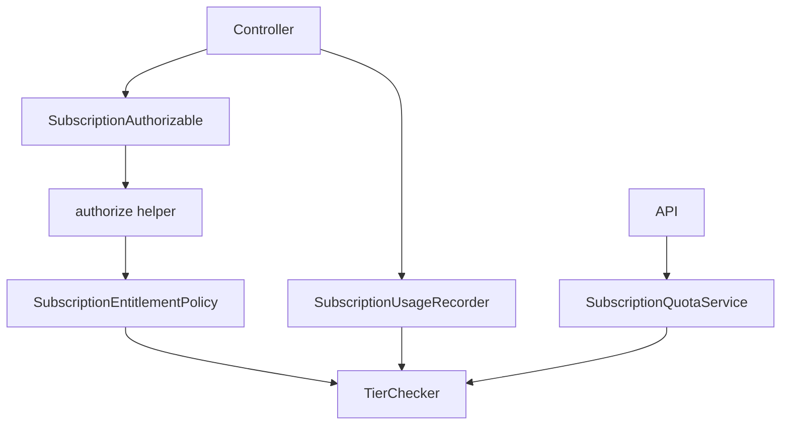
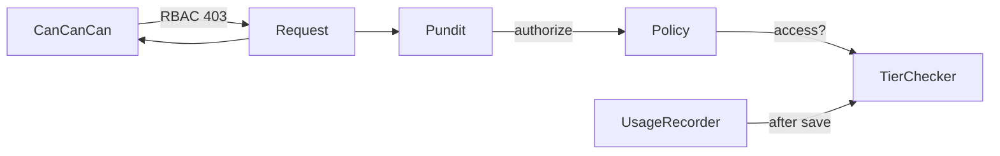

# Subscription Pundit — Technical Implementation Plan

Companion to [subscription-tiers-features.md](./subscription-tiers-features.md).

Reviewed against [Pundit](https://github.com/varvet/pundit) conventions. CanCanCan stays for RBAC. Pundit handles subscription limits only.

---

## Review — what the first draft got wrong

| Issue | Pundit best practice | Fix in this plan |
|-------|----------------------|------------------|
| Manual `Policy.new` + `raise Pundit::NotAuthorizedError` | Use `authorize` helper — Pundit raises for you | Concern calls `authorize(...)` |
| Custom `allow?` query | Query methods end with `?`; use a clear name like `access?` | `SubscriptionEntitlementPolicy#access?` |
| `SubscriptionAuthorizer` doing authorization | Pundit **is** the authorizer — extra service duplicates it | Remove authorizer; add `SubscriptionUsageRecorder` for metering only |
| `subscription_authorizer` defined twice | Single source in `ApplicationController` | One helper, concern delegates to controller |
| `after_action` + `response.successful?` for usage | Usage is not authorization — record after persistence | `SubscriptionUsageRecorder.record!` after `save` |
| Views instantiate policy manually | Use `policy(record).access?` | `subscription_allowed?` helper wraps `policy()` |
| No `verify_authorized` | Pundit recommends catching forgotten checks | Document when to use / skip |
| `tier_checker` in base `ApplicationPolicy` | Base policy should be generic | Tier logic only in `SubscriptionEntitlementPolicy` |

---

## Design



| Layer | Responsibility |
|-------|----------------|
| **CanCanCan** | RBAC — unchanged |
| **`authorize`** | Pundit entry point in controllers |
| **`SubscriptionEntitlementPolicy`** | `access?` → delegates to `TierChecker` |
| **`TierChecker`** | Quota math — single source of truth |
| **`SubscriptionUsageRecorder`** | Increment counters after successful action |
| **`SubscriptionQuotaService`** | API check + consume |

Authorization and usage metering are **separate**. Pundit does not record usage.

---

## File structure

```
app/
  value_objects/
    subscription_context.rb
  policies/
    application_policy.rb
    subscription_entitlement_policy.rb
  services/
    subscription_usage_recorder.rb
    subscription_quota_service.rb
    tier_checker.rb                    # cleanup only
  controllers/
    concerns/
      subscription_authorizable.rb
config/
  initializers/
    pundit.rb
lib/
  subscription_features.rb
```

**6 new files.** No ActiveRecord changes.

---

## Step 1 — Gemfile & install

```ruby
gem "pundit", "~> 2.3"
```

```bash
bundle install
rails g pundit:install
```

---

## Step 2 — Feature constants

**`lib/subscription_features.rb`**

```ruby
module SubscriptionFeatures
  MAX_CBAIS         = "max_cbais"
  MAX_CONVERSATIONS = "max_conversations"
  MAX_DOCUMENTS     = "max_documents"
  ANALYTICS         = "analytics_enabled"
  PRIORITY_SUPPORT  = "priority_support"
end
```

Already autoloaded via `config.autoload_lib` in `config/application.rb`.

---

## Step 3 — Value object (Pundit record)

**Not** in `app/models/` — this is not ActiveRecord.

**`app/value_objects/subscription_context.rb`**

```ruby
class SubscriptionContext
  attr_reader :cbai, :feature_key

  def initialize(feature_key:, cbai: nil)
    @feature_key = feature_key.to_s
    @cbai = cbai
  end

  # Pundit resolves policy from record — no policy_class: needed at call site
  def self.policy_class
    SubscriptionEntitlementPolicy
  end
end
```

Pundit supports `policy_class` as a class method on the record ([docs](https://github.com/varvet/pundit#manually-specifying-policy-classes)).

`user` comes from Pundit's `pundit_user` (i.e. `current_user`) — do not store it on the context.

---

## Step 4 — Policies

### `app/policies/application_policy.rb`

Standard Pundit base — deny by default:

```ruby
class ApplicationPolicy
  attr_reader :user, :record

  def initialize(user, record)
    @user = user
    @record = record
  end

  def index?  = false
  def show?   = false
  def create? = false
  def update? = false
  def destroy? = false

  class Scope
    attr_reader :user, :scope

    def initialize(user, scope)
      @user = user
      @scope = scope
    end

    def resolve = scope.all
  end
end
```

### `app/policies/subscription_entitlement_policy.rb`

One policy, one query method:

```ruby
class SubscriptionEntitlementPolicy < ApplicationPolicy
  def access?
    return false if user.blank?
    return false unless record.is_a?(SubscriptionContext)

    tier_checker.can_use?(record.feature_key)
  end

  private

  def tier_checker
    @tier_checker ||= TierChecker.new(user, record.cbai)
  end
end
```

- No limit math here — only delegation.
- `access?` is the single entitlement query (headless-style, but with a rich record).

---

## Step 5 — Controller concern (uses `authorize`)

**`app/controllers/concerns/subscription_authorizable.rb`**

```ruby
module SubscriptionAuthorizable
  extend ActiveSupport::Concern

  class_methods do
    # Runs Pundit before the action.
    #   requires_subscription SubscriptionFeatures::MAX_CBAIS, only: :create
    def requires_subscription(feature_key, **options)
      before_action(options) do
        authorize subscription_context(feature_key), :access?
      end
    end
  end
end
```

This is idiomatic Pundit:

- `authorize` sets `@_pundit_policy_authorized = true`
- Raises `Pundit::NotAuthorizedError` automatically on failure
- Works with `verify_authorized` in development

**Controller example:**

```ruby
class Client::CbaisController < ApplicationController
  include SubscriptionAuthorizable

  requires_subscription SubscriptionFeatures::MAX_CBAIS, only: :create

  def create
    @cbai = Cbai.new(cbai_params)
    if @cbai.save
      SubscriptionUsageRecorder.record!(
        user: current_user,
        feature_key: SubscriptionFeatures::MAX_CBAIS
      )
      redirect_to @cbai
    else
      render :new, status: :unprocessable_entity
    end
  end
end
```

CanCanCan `load_and_authorize_resource` still handles RBAC. Pundit runs via `before_action`.

> **Gate vs counter features:** `max_cbais` uses `gate` strategy (counts live records) — no `record!` needed. Only call `SubscriptionUsageRecorder` for `counter` / `model_cost` features like `max_conversations`.

---

## Step 6 — Usage recorder (not Pundit)

**`app/services/subscription_usage_recorder.rb`**

```ruby
class SubscriptionUsageRecorder
  def self.record!(user:, feature_key:, cbai: nil, amount: 1)
    TierChecker.new(user, cbai).record_usage!(feature_key, amount)
  end
end
```

Metering is a side effect after success — never inside a policy or `authorize`.

---

## Step 7 — ApplicationController

```ruby
class ApplicationController < ActionController::Base
  include Pundit::Authorization

  helper_method :tier_checker, :subscription_allowed?

  def subscription_context(feature_key)
    SubscriptionContext.new(feature_key: feature_key, cbai: @cbai)
  end

  def tier_checker
    @tier_checker ||= TierChecker.new(current_user, @cbai)
  end

  def subscription_allowed?(feature_key)
    policy(subscription_context(feature_key)).access?
  end

  rescue_from Pundit::NotAuthorizedError do |_exception|
    respond_to do |format|
      format.html { redirect_to client_subscriptions_path, alert: "Upgrade your plan to use this feature." }
      format.json { render json: { error: "plan_limit" }, status: :payment_required }
      format.turbo_stream { redirect_to client_subscriptions_path, alert: "Upgrade your plan to use this feature." }
      format.any { head :payment_required }
    end
  end

  # Keep existing rescue_from CanCan::AccessDenied → 403
end
```

| Error | HTTP | System |
|-------|------|--------|
| `CanCan::AccessDenied` | 403 | Team / role |
| `Pundit::NotAuthorizedError` | 402 | Plan limit |

### `verify_authorized` (recommended for client/admin)

In `Client::BaseController` or per-controller:

```ruby
after_action :verify_authorized, except: :index
```

- Skips `index` (use `verify_policy_scoped` if you add scopes later)
- Public/API controllers: call `skip_authorization` where Pundit is not used

```ruby
# ApiController#quota — no Pundit, uses service directly
def quota
  skip_authorization
  # ...
end
```

---

## Step 8 — Pundit initializer

**`config/initializers/pundit.rb`**

```ruby
# Optional: customize error message
# Pundit::NotAuthorizedError = Class.new(StandardError) # default is fine
```

No custom config required for basic setup.

---

## Step 9 — Views

Use Pundit's `policy()` — never `Policy.new` in templates:

```haml
- if subscription_allowed?(SubscriptionFeatures::ANALYTICS)
  = link_to "Analytics", client_analytics_path
- else
  %span.text-gray-400 Analytics (upgrade required)
```

Usage display — `tier_checker` helper (unchanged):

```haml
- used = tier_checker.usage_for(SubscriptionFeatures::MAX_CONVERSATIONS)
- limit = tier_checker.limit_for(SubscriptionFeatures::MAX_CONVERSATIONS)
```

---

## Step 10 — API quota service

**`app/services/subscription_quota_service.rb`**

```ruby
class SubscriptionQuotaService
  Result = Data.define(:allowed, :remaining)

  def initialize(user:, cbai:)
    @checker = TierChecker.new(user, cbai)
    @feature_key = SubscriptionFeatures::MAX_CONVERSATIONS
  end

  def call
    remaining = @checker.remaining(@feature_key)

    unless @checker.can_use?(@feature_key)
      return Result.new(allowed: false, remaining: 0)
    end

    SubscriptionUsageRecorder.record!(
      user: @checker.user,
      cbai: @checker.cbai,
      feature_key: @feature_key
    )

    display_remaining = remaining == Float::INFINITY ? nil : remaining
    Result.new(allowed: true, remaining: display_remaining)
  end
end
```

**`ApiController#quota`:**

```ruby
def quota
  skip_authorization

  cbai = Cbai.find_by(token: params[:token])
  return render json: { error: "Not found" }, status: :not_found unless cbai

  owner = cbai.owners.first || User.admin.first
  result = SubscriptionQuotaService.new(user: owner, cbai: cbai).call

  render json: { allowed: result.allowed, remaining: result.remaining }
rescue StandardError => e
  Rails.logger.error "[Quota] #{e.message}"
  render json: { allowed: true, remaining: nil } # fail open
end
```

---

## Step 11 — Clean up TierChecker

Remove WIP code replaced by Pundit:

- `puts`, `pry`
- `features_for_location`, `allowed_at?`, `enforce_at!`, `LimitExceeded`

Remove from `Admin::CbaiUsersController`:

- `enforce_tier_limits` → `requires_subscription SubscriptionFeatures::MAX_CBAIS, only: :create`

---

## Rollout checklist

| # | Task |
|---|------|
| 1 | Add `pundit` gem, run installer |
| 2 | `lib/subscription_features.rb` |
| 3 | `app/value_objects/subscription_context.rb` |
| 4 | `app/policies/application_policy.rb` + `subscription_entitlement_policy.rb` |
| 5 | `app/services/subscription_usage_recorder.rb` |
| 6 | `app/controllers/concerns/subscription_authorizable.rb` |
| 7 | Wire `ApplicationController` |
| 8 | `app/services/subscription_quota_service.rb` |
| 9 | Clean `TierChecker` |
| 10 | Migrate controllers |
| 11 | Add tests |

### Controllers to migrate

| Controller | Feature | Pundit | Usage record |
|------------|---------|--------|--------------|
| `Client::CbaisController#create` | `MAX_CBAIS` | `requires_subscription` | No (`gate`) |
| `Client::DocumentsController#create` | `MAX_DOCUMENTS` | `requires_subscription` | No (`gate`) |
| `Admin::CbaiUsersController#create` | `MAX_CBAIS` | `requires_subscription` | No (`gate`) |
| `Admin::AnalyticsController` | `ANALYTICS` | `requires_subscription` | No (boolean) |
| `ApiController#quota` | `MAX_CONVERSATIONS` | `skip_authorization` + service | Yes (`counter`) |

---

## Testing (Pundit conventions)

**Policy unit test:**

```ruby
class SubscriptionEntitlementPolicyTest < ActiveSupport::TestCase
  test "access? allowed when under limit" do
    user = users(:client)
    context = SubscriptionContext.new(feature_key: SubscriptionFeatures::MAX_CBAIS)

    assert SubscriptionEntitlementPolicy.new(user, context).access?
  end

  test "access? denied when limit reached" do
    # setup user at max_cbais limit
    refute SubscriptionEntitlementPolicy.new(user, context).access?
  end
end
```

**Controller test:**

```ruby
test "create returns 402 when plan limit reached" do
  assert_raises(Pundit::NotAuthorizedError) do
    # or assert_response :payment_required with integration test
  end
end
```

| File | Covers |
|------|--------|
| `test/policies/subscription_entitlement_policy_test.rb` | `access?` per tier |
| `test/services/tier_checker_test.rb` | Quota math (existing) |
| `test/services/subscription_usage_recorder_test.rb` | Delegates to TierChecker |
| `test/services/subscription_quota_service_test.rb` | API responses |

---

## Summary



| Question | Answered by |
|----------|-------------|
| Can this editor manage this CBAI? | CanCanCan |
| Does this plan allow this feature? | `authorize` → `SubscriptionEntitlementPolicy#access?` → `TierChecker` |
| Record a conversation usage? | `SubscriptionUsageRecorder` (not Pundit) |
| How many conversations left? | `tier_checker` helper |

**Pundit rules we follow:**

1. Controllers call `authorize` — never instantiate policies manually
2. Views call `policy(record).access?` — via `subscription_allowed?` helper
3. Policies are thin — delegate to `TierChecker`
4. Usage recording is outside Pundit
5. `verify_authorized` / `skip_authorization` used appropriately
6. One subscription policy — no per-model policy duplication
