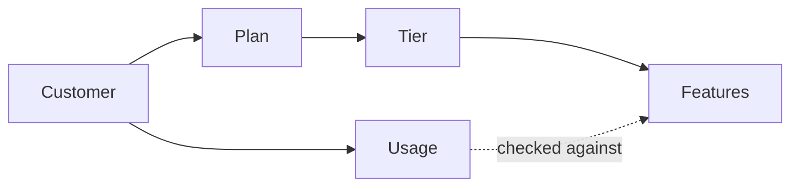
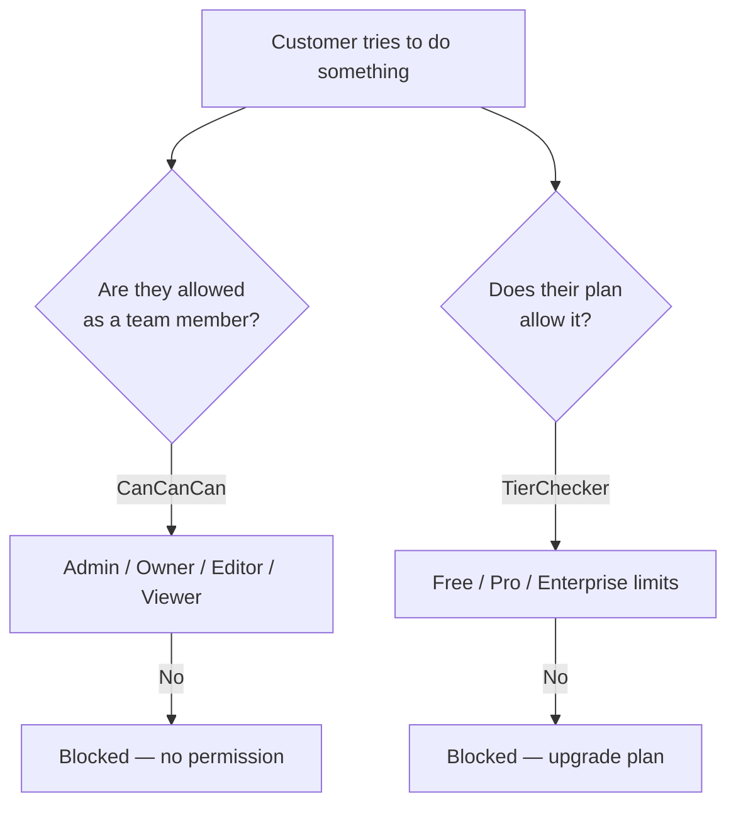
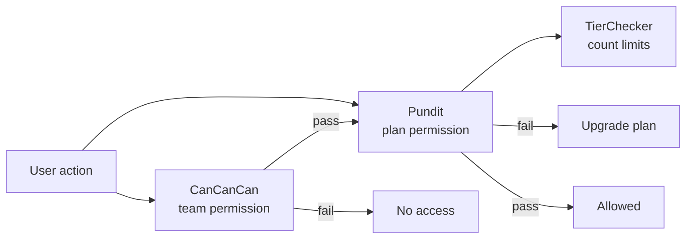
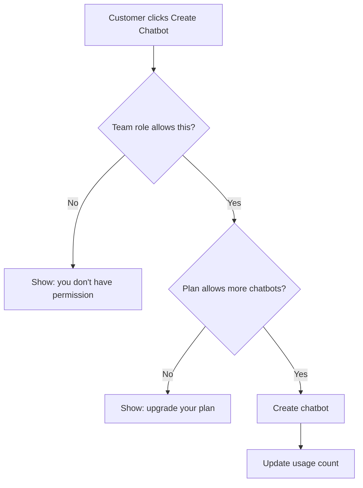
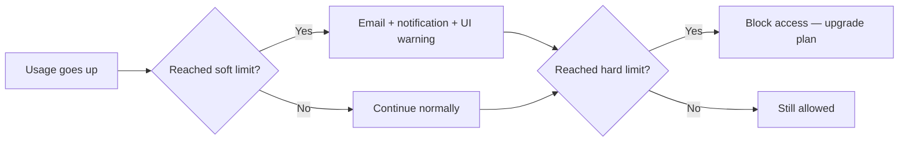
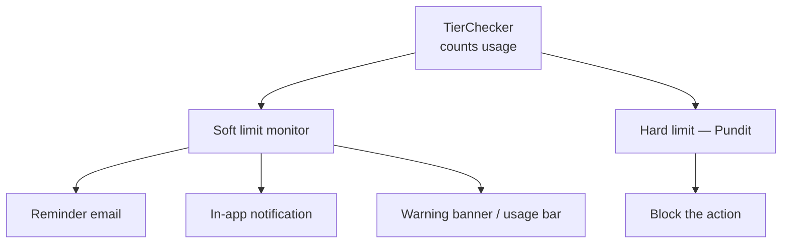
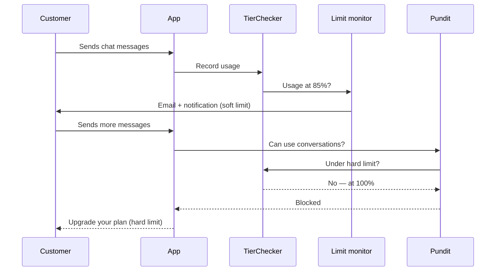

# Subscription Plans, Tiers, and Features

A simple guide to how paid plans work in ChatBar AI, and how we plan to enforce feature limits in the future.

---

## 1. How It Works Today

### The big picture

A customer picks a **plan** (what they pay). Each plan belongs to a **tier** (what they get). The tier decides which features are available and what the limits are.

**In plain terms:**

| Term | What it means |
|------|---------------|
| **Plan** | The product on the pricing page — e.g. Free, Monthly, Annual. Includes price and billing. |
| **Tier** | The package of features behind a plan — e.g. Free tier, Pro tier, Enterprise tier. |
| **Subscription** | The link between a customer and their active plan. |
| **Feature** | One thing we can limit — e.g. number of chatbots, monthly conversations, analytics on/off. |
| **Usage** | How much the customer has already used (e.g. conversations this month). |

---

### Example: what each tier gets

| Feature | Free | Pro | Enterprise |
|---------|------|-----|------------|
| Chatbot instances | 1 | 5 | Unlimited |
| Conversations per month | 100 | 1,000 | Unlimited |
| Documents | 5 | 50 | Unlimited |
| Analytics | No | Yes | Yes |
| Priority support | No | No | Yes |

Some limits are **numbers** (how many you can create).  
Some are **yes/no** (a feature is on or off for that tier).

---

### How we check limits today

When a customer tries to do something (create a chatbot, send a message, open analytics), the system asks:

1. What plan are they on?
2. What does that tier allow?
3. Have they already hit the limit?

If yes → action is allowed.  
If no → action is blocked (usually with a message to upgrade).

This checking logic lives in a service called **TierChecker**.

---

### Two different kinds of access control

The app uses **two separate checks**. They answer different questions:

| Check | Question it answers | Example |
|-------|---------------------|---------|
| **CanCanCan** (RBAC) | Who is this person on the team? | A "viewer" can read but not edit. |
| **TierChecker** | What does their paid plan allow? | Free plan allows only 1 chatbot. |

These must stay separate. Team permissions and plan limits are not the same thing.

---

## 2. Future Plan — Pundit for Subscription Limits

### What we want

- **Keep CanCanCan** — still handles team roles (admin, owner, editor, viewer).
- **Add Pundit** — handles plan/subscription limits only.
- **Keep TierChecker** — still does the actual counting and limit math.

**Simple rule:** CanCanCan asks *"who are you?"* — Pundit asks *"does your plan include this?"*

---

### What happens on each request (future)

Both checks must pass. Failing the team check and failing the plan check show different messages.

---

### Rollout steps

| Step | What we do |
|------|------------|
| 1 | Clean up and finish the limit-checking service (TierChecker) |
| 2 | Add Pundit to the project |
| 3 | Create simple rules per feature — e.g. "can create chatbot?", "can use analytics?" |
| 4 | Add those checks to the right pages and API endpoints |
| 5 | Hide or disable buttons in the UI when the plan doesn't include a feature |
| 6 | Test that team permissions still work and plan limits work separately |
| 7 | Add soft-limit warnings — see [section 3](#3-future-plan--soft-limit--hard-limit) |

---

### What we will NOT change

- We are **not** replacing CanCanCan.
- We are **not** mixing team roles into subscription rules.
- Plan limit rules will **not** duplicate the counting logic — they will use TierChecker.

---

### Summary

| Question | Who answers it |
|----------|----------------|
| Is this person an admin? | CanCanCan |
| Can this editor change this chatbot? | CanCanCan |
| Can this customer create another chatbot on their plan? | Pundit → TierChecker |
| Does their plan include analytics? | Pundit → TierChecker |
| How many conversations do they have left? | TierChecker |
| Should we warn them they're running low? | Limit monitor (soft limit — section 3) |
| Should we block them when quota is full? | Pundit → TierChecker (hard limit — section 3) |

**Today:** plan limits are checked with TierChecker only.  
**Future:** Pundit becomes the friendly gate for plan limits; TierChecker still does the counting behind the scenes.

Technical details: [subscription-pundit-implementation.md](./subscription-pundit-implementation.md).

---

## 3. Future Plan — Soft Limit & Hard Limit

Each numeric feature (e.g. monthly conversations) can have **two levels** of limit:

| Type | What it does | Customer experience |
|------|--------------|---------------------|
| **Soft limit** | Warns when usage is getting high | Email, in-app notification, dashboard banner — **still allowed to use the feature** |
| **Hard limit** | Blocks when usage hits the cap | Feature is **restricted** — must upgrade or wait for reset |

Boolean features (analytics on/off) only have a hard limit — they are either included or not. Soft limits apply to **count-based** features only.

---

### Example: conversations on the Pro plan (1,000 / month)

| Usage | What happens |
|-------|--------------|
| 700 / 1,000 | Normal — no warning |
| 850 / 1,000 (85%) | **Soft limit** — email: *"You've used 85% of your monthly conversations"* + notice in dashboard |
| 1,000 / 1,000 | **Hard limit** — cannot send more messages until next month or upgrade |

---

### Who handles what

Soft and hard limits work **together**, but different parts of the system handle each job:

| Job | Tool | Role |
|-----|------|------|
| Count usage | **TierChecker** | Single source of truth for "how much used" |
| Soft limit — detect & notify | **Limit monitor + mailer** | Checks threshold (e.g. 80%), sends reminders |
| Soft limit — show in UI | **Dashboard / navbar** | Usage bar, warning messages (partially exists today) |
| Hard limit — block access | **Pundit** | Denies the action at 100% |

**Pundit only does hard limits.** It answers: *"Can this user do this right now?"* — yes or no.

Soft limits are **not** access control. They are reminders. Pundit should not send emails or show "you're at 80%" messages.

---

### Soft limit details (planned)

**When to warn**

- Default: when usage reaches **80%** of the hard limit (configurable per feature).
- Example: Pro plan = 1,000 conversations → soft warning at 800.

**How we notify the customer**

| Channel | Example |
|---------|---------|
| Email | *"Hi [name], you've used 850 of 1,000 conversations this month."* |
| In-app notification | Alert in the dashboard (uses existing Notification system) |
| UI | Usage bar turns yellow/red (navbar already shows conversation usage) |

**Avoid spam**

- Send the soft-limit email **once per billing period** per feature (not on every message).
- Track that we already notified the user for this month.

---

### Hard limit details (planned)

**When to block**

- When usage reaches **100%** of the tier limit (or feature is disabled on that tier).

**What the customer sees**

| Context | Result |
|---------|--------|
| Web dashboard | Redirect to subscriptions page — *"Upgrade your plan to continue"* |
| API / chatbot | Message blocked — quota exhausted |
| Boolean feature (e.g. analytics) | Page hidden or disabled — feature not on their plan |

Handled by **Pundit** at the moment they try to use the feature, using **TierChecker** to check if quota remains.

---

### Full journey (soft + hard + Pundit)

---

### Rollout steps (soft + hard)

| Step | What we do |
|------|------------|
| 1 | Add soft-limit threshold to feature config (e.g. 80%) |
| 2 | Build limit monitor — runs after usage is recorded or on a daily schedule |
| 3 | Add reminder email template and mailer |
| 4 | Create in-app notification when soft limit is hit |
| 5 | Implement hard limit with Pundit (see section 2) |
| 6 | Test full flow: normal → warning → blocked |

---

### Summary — soft vs hard

| | Soft limit | Hard limit |
|---|------------|------------|
| **Purpose** | Inform & remind | Restrict access |
| **When** | e.g. 80% of quota | 100% of quota |
| **Customer can still use feature?** | Yes | No |
| **Handled by** | Monitor + email + UI | Pundit + TierChecker |
| **Pundit involved?** | No | Yes |

**One engine (TierChecker), two behaviors:** warn early with soft limits, stop at the cap with hard limits via Pundit.

