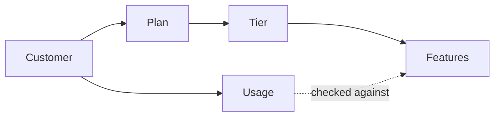
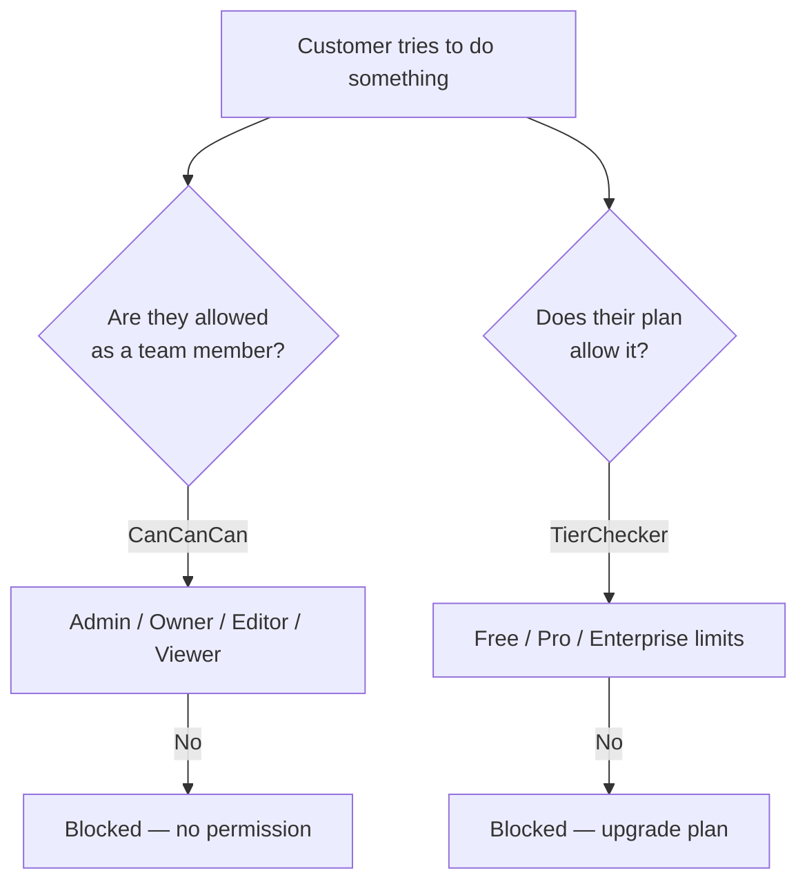
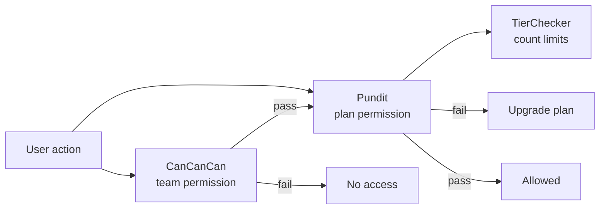
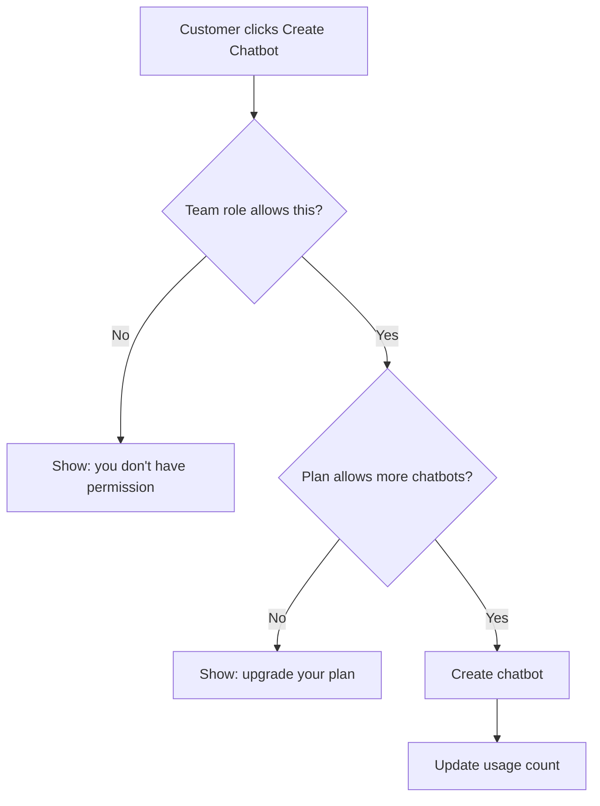

# Subscription Plans, Tiers, and Features

A simple guide to how paid plans work in ChatBar AI, and how we plan to enforce feature limits in the future.

---

## 1. How It Works Today

### The big picture

A customer picks a **plan** (what they pay). Each plan belongs to a **tier** (what they get). The tier decides which features are available and what the limits are.

**In plain terms:**

| Term | What it means |
|------|---------------|
| **Plan** | The product on the pricing page — e.g. Free, Monthly, Annual. Includes price and billing. |
| **Tier** | The package of features behind a plan — e.g. Free tier, Pro tier, Enterprise tier. |
| **Subscription** | The link between a customer and their active plan. |
| **Feature** | One thing we can limit — e.g. number of chatbots, monthly conversations, analytics on/off. |
| **Usage** | How much the customer has already used (e.g. conversations this month). |

---

### Example: what each tier gets

| Feature | Free | Pro | Enterprise |
|---------|------|-----|------------|
| Chatbot instances | 1 | 5 | Unlimited |
| Conversations per month | 100 | 1,000 | Unlimited |
| Documents | 5 | 50 | Unlimited |
| Analytics | No | Yes | Yes |
| Priority support | No | No | Yes |

Some limits are **numbers** (how many you can create).  
Some are **yes/no** (a feature is on or off for that tier).

---

### How we check limits today

When a customer tries to do something (create a chatbot, send a message, open analytics), the system asks:

1. What plan are they on?
2. What does that tier allow?
3. Have they already hit the limit?

If yes → action is allowed.  
If no → action is blocked (usually with a message to upgrade).

This checking logic lives in a service called **TierChecker**.

---

### Two different kinds of access control

The app uses **two separate checks**. They answer different questions:

| Check | Question it answers | Example |
|-------|---------------------|---------|
| **CanCanCan** (RBAC) | Who is this person on the team? | A "viewer" can read but not edit. |
| **TierChecker** | What does their paid plan allow? | Free plan allows only 1 chatbot. |

These must stay separate. Team permissions and plan limits are not the same thing.

---

## 2. Future Plan — Pundit for Subscription Limits

### What we want

- **Keep CanCanCan** — still handles team roles (admin, owner, editor, viewer).
- **Add Pundit** — handles plan/subscription limits only.
- **Keep TierChecker** — still does the actual counting and limit math.

**Simple rule:** CanCanCan asks *"who are you?"* — Pundit asks *"does your plan include this?"*

---

### What happens on each request (future)

Both checks must pass. Failing the team check and failing the plan check show different messages.

---

### Rollout steps

| Step | What we do |
|------|------------|
| 1 | Clean up and finish the limit-checking service (TierChecker) |
| 2 | Add Pundit to the project |
| 3 | Create simple rules per feature — e.g. "can create chatbot?", "can use analytics?" |
| 4 | Add those checks to the right pages and API endpoints |
| 5 | Hide or disable buttons in the UI when the plan doesn't include a feature |
| 6 | Test that team permissions still work and plan limits work separately |

---

### What we will NOT change

- We are **not** replacing CanCanCan.
- We are **not** mixing team roles into subscription rules.
- Plan limit rules will **not** duplicate the counting logic — they will use TierChecker.

---

### Summary

| Question | Who answers it |
|----------|----------------|
| Is this person an admin? | CanCanCan |
| Can this editor change this chatbot? | CanCanCan |
| Can this customer create another chatbot on their plan? | Pundit → TierChecker |
| Does their plan include analytics? | Pundit → TierChecker |
| How many conversations do they have left? | TierChecker |

**Today:** plan limits are checked with TierChecker only.  
**Future:** Pundit becomes the friendly gate for plan limits; TierChecker still does the counting behind the scenes.
